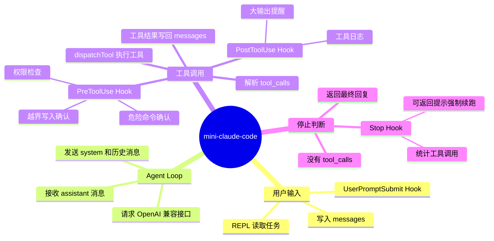

# mini-claude-code

一个最小的 AI 编程 Agent，完整实现 `learn-claude-code/s01_agent_loop` 的核心模式——**Agent Loop**：

```
+----------+      +-------+      +---------+
|   User   | ---> |  LLM  | ---> |  Tool   |
|  prompt  |      |       |      | execute |
+----------+      +---+---+      +----+----+
                        ^               |
                        |   tool_result |
                        +---------------+
                        (loop continues)
```

整个 AI 编程 Agent 的秘密就在这一个模式里：

```ts
while (model wants to use a tool) {
    response = LLM(messages, tools)
    execute tools
    append results
}
```

生产级 Agent 只是在此基础上叠加了权限控制、hooks 和生命周期管理。

## 流程思维图



## 技术栈

- **Node.js + TypeScript + pnpm**
- **DeepSeek** 大模型（或任意 OpenAI 兼容模型），经 **AIHubMix / 硅基流动 / 魔搭社区** 等网关以 **OpenAI 兼容接口** 接入
- 仅一个工具：`bash`（运行 shell 命令）

> 三家网关（`aihubmix` / `siliconflow` / `modelscope`）均为 OpenAI 兼容接口，代码无差异，仅 base URL、API Key 与模型名不同，通过 `.env` 切换即可。

## 目录结构

```
mini-claude-code/
├── src/
│   ├── config.ts   # AIHubMix client、模型、system 提示、工具定义
│   ├── tools.ts    # bash 工具执行（危险命令拦截、超时、输出截断）
│   ├── agent.ts    # agent loop 核心
│   └── index.ts    # REPL 交互入口
├── package.json
├── tsconfig.json
└── .env.example
```

## 快速开始

```bash
# 1. 安装依赖
pnpm install

# 2. 配置 .env（复制示例，填入接口地址、Key 与模型名）
cp .env.example .env
# BASE_URL=https://aihubmix.com/v1
# API_KEY=sk-xxx
# MODEL_ID=deepseek-chat

# 3. 运行
pnpm dev
```

### 切换到其他服务商

直接改 `.env` 的 `BASE_URL`、`API_KEY`、`MODEL_ID` 三行即可：

| 服务商   | BASE_URL                                | DeepSeek 模型名示例                |
| -------- | --------------------------------------- | ---------------------------------- |
| AIHubMix | `https://aihubmix.com/v1`               | `deepseek-chat` / `deepseek-reasoner` |
| 硅基流动 | `https://api.siliconflow.cn/v1`         | `deepseek-ai/DeepSeek-V3` / `deepseek-ai/DeepSeek-R1` |
| 魔搭社区 | `https://api-inference.modelscope.cn/v1` | `deepseek-ai/DeepSeek-V3` / `deepseek-ai/DeepSeek-R1` |

构建为纯 JS：

```bash
pnpm build
pnpm start
```

## 使用

启动后进入交互式 REPL：输入任务，回车发送；输入 `q` 退出。
Agent 会自行调用 `bash` 工具完成任务，并将命令输出反馈给模型，直到模型判断任务完成。

> 注意：由于通过 OpenAI 兼容接口接入，工具调用采用 OpenAI 的 `tools` / `tool_calls` 格式（而非 Anthropic 的 `tool_use` 格式）。
