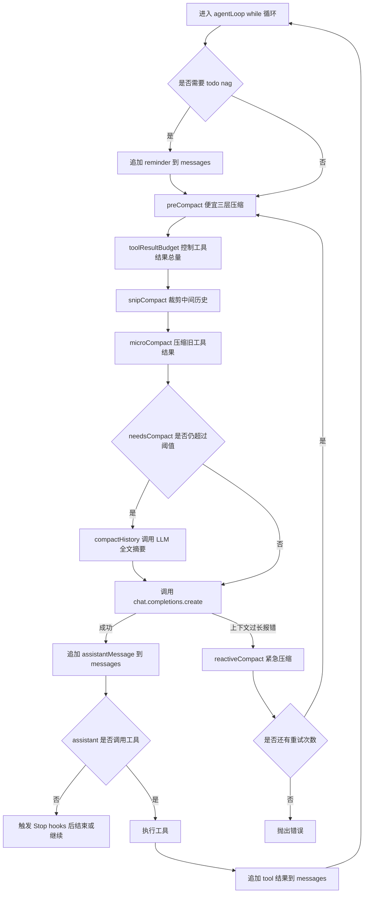

# 上下文压缩流程学习笔记

本文档说明 `mini-claude-code` 中上下文压缩的完整流程，核心代码位于：

- `src/agent.ts`：在 `agentLoop` 中决定什么时候压缩、什么时候调用模型。
- `src/context.ts`：实现具体压缩策略。

## 1. 背景

Agent 的上下文主要保存在 `messages: Msg[]` 里。

每一轮循环都会把当前上下文发给模型：

```ts
messages: [system, ...messages]
```

其中：

- `system` 是系统提示词，每轮临时拼进去，不写入 `messages`。
- `messages` 保存用户消息、assistant 回复、tool 调用结果。
- 工具调用越多，`tool` 消息越容易变大，所以压缩主要围绕工具结果和旧历史展开。

压缩的目标不是保存完整历史，而是在上下文窗口有限的情况下，让模型继续知道：

- 当前目标是什么。
- 已经做过哪些关键判断。
- 最近几轮正在处理什么。
- 哪些工具结果已经被压缩，必要时可以重新运行。

## 2. 总体入口

入口在 `agentLoop(messages)` 的每轮循环开始处：

```ts
const compacted = preCompact(messages);
messages.length = 0;
messages.push(...compacted);

if (needsCompact(messages)) {
  console.log("[auto compact]");
  const c = await compactHistory(messages);
  messages.length = 0;
  messages.push(...c);
}
```

这里有两个关键点：

1. 先执行 `preCompact(messages)`，这是便宜压缩，不调用模型 API。
2. 如果压缩后仍然超过阈值，再执行 `compactHistory(messages)`，用模型生成摘要。

`messages.length = 0` 和 `messages.push(...compacted)` 是原地替换数组内容。

这样做的好处是：如果外部也持有同一个 `messages` 引用，引用本身不变，只更新里面的消息。

## 3. 总体流程图



## 4. 第一阶段：preCompact 便宜压缩

`preCompact` 是每轮模型调用前都会执行的预处理：

```ts
export function preCompact(messages: Msg[]): Msg[] {
  let m = toolResultBudget(messages);
  m = snipCompact(m);
  m = microCompact(m);
  return m;
}
```

它包含三层，不调用模型 API：

1. `toolResultBudget`：先处理超大的工具输出。
2. `snipCompact`：如果消息条数太多，裁剪中间历史。
3. `microCompact`：把旧工具结果替换成占位符。

顺序很重要。先处理大块工具输出，可以快速降低上下文体积；再裁剪条数；最后替换旧工具结果，保留最近工具结果的可读性。

## 5. L3：toolResultBudget

虽然注释里称为 L3，但在 `preCompact` 中它最先执行。

作用：当所有 `tool` 消息内容总量超过 `maxBytes = 200_000` 时，优先压缩最大的工具输出。

核心逻辑：

```ts
const toolMsgs = messages.filter(isToolMessage) as any[];
let total = toolMsgs.reduce((s, m) => s + contentLength, 0);
if (total <= maxBytes) return messages;
```

如果工具输出总量没超过预算，就直接返回。

超过后，会按内容长度从大到小排序：

```ts
const ranked = [...toolMsgs].sort(
  (a, b) => (b.content?.length ?? 0) - (a.content?.length ?? 0),
);
```

然后只处理超过 `PERSIST_THRESHOLD = 30_000` 的大结果：

```ts
m.content = `<persisted-output>\nPreview:\n${c.slice(0, 2000)}\n</persisted-output>`;
```

注意：当前实现并没有真的把完整结果写入文件，只是把上下文里的完整输出替换为 2000 字符预览。

压缩前：

```json
{
  "role": "tool",
  "tool_call_id": "call_1",
  "content": "非常长的工具输出..."
}
```

压缩后：

```json
{
  "role": "tool",
  "tool_call_id": "call_1",
  "content": "<persisted-output>\nPreview:\n前 2000 字符\n</persisted-output>"
}
```

保留 `role` 和 `tool_call_id` 是必须的，因为 OpenAI 工具调用协议要求 assistant 的 `tool_calls` 和后续 `tool` 消息能对应起来。

## 6. L1：snipCompact

作用：当消息条数超过 `maxMessages = 50` 时，裁剪中间消息。

策略是：

- 保留开头 3 条消息。
- 保留最近一批消息。
- 中间被裁掉的部分用一条占位消息替代。

核心结构：

```ts
return [
  ...messages.slice(0, headEnd),
  { role: "user", content: `[snipped ${snipped} messages]` } as Msg,
  ...messages.slice(tailStart),
];
```

为什么保留开头？

开头通常包含用户初始目标、重要约束、任务背景。

为什么保留尾部？

尾部是当前正在进行的工作，模型最需要最近几轮上下文来继续推理。

为什么不直接按固定下标裁？

因为工具消息有配对关系：

```text
assistant message with tool_calls
tool message with tool_call_id
```

如果裁剪时把这对消息拆开，模型 API 可能报错，或者模型会失去工具结果对应关系。

所以代码做了两个边界修正：

```ts
while (headEnd < messages.length && isToolMessage(messages[headEnd])) headEnd++;
```

这段避免头部保留区以孤立的 `tool` 消息开头。

```ts
while (
  tailStart > 0 &&
  tailStart < messages.length &&
  isToolMessage(messages[tailStart]) &&
  hasToolCalls(messages[tailStart - 1])
) {
  tailStart--;
}
```

这段避免尾部保留区从一组 assistant/tool 调用链中间开始。

压缩前：

```text
msg1
msg2
msg3
msg4
...
msg80
```

压缩后：

```text
msg1
msg2
msg3
[snipped 30 messages]
msg34
...
msg80
```

## 7. L2：microCompact

作用：把较早的工具结果替换为占位符，但保留最近 `KEEP_RECENT = 3` 条工具结果。

核心逻辑：

```ts
const toolMsgs = messages.filter(isToolMessage);
if (toolMsgs.length <= KEEP_RECENT) return messages;

const oldOnes = toolMsgs.slice(0, toolMsgs.length - KEEP_RECENT);
const ids = new Set(oldOnes.map((m) => (m as any).tool_call_id));
```

然后只替换满足条件的工具结果：

- 是 `tool` 消息。
- 属于较早的工具结果。
- `content` 是字符串。
- 内容长度超过 120。

替换内容：

```ts
"[Earlier tool result compacted. Re-run if needed.]"
```

压缩前：

```json
{
  "role": "tool",
  "tool_call_id": "call_old",
  "content": "旧的长工具结果..."
}
```

压缩后：

```json
{
  "role": "tool",
  "tool_call_id": "call_old",
  "content": "[Earlier tool result compacted. Re-run if needed.]"
}
```

这里同样保留 `tool_call_id`，只替换 `content`。

## 8. needsCompact 阈值判断

便宜压缩结束后，会调用：

```ts
export function needsCompact(messages: Msg[]): boolean {
  return estimateSize(messages) > CONTEXT_LIMIT;
}
```

其中：

```ts
const CONTEXT_LIMIT = 50_000;
```

`estimateSize` 的实现是：

```ts
return JSON.stringify(msgs).length;
```

这不是精确 token 计算，而是一个便宜的启发式估算。

优点是简单、快、不依赖 tokenizer。

缺点是和真实模型 token 数不完全一致，所以后面还需要 `reactiveCompact` 兜底。

## 9. L4：compactHistory 全文摘要

如果 `needsCompact(messages)` 返回 `true`，说明便宜压缩后仍然太大，就会调用：

```ts
const c = await compactHistory(messages);
messages.length = 0;
messages.push(...c);
```

`compactHistory` 会调用 `summarize(messages)`，让模型总结整段历史：

```ts
export async function compactHistory(messages: Msg[]): Promise<Msg[]> {
  const summary = await summarize(messages);
  return [{ role: "user", content: `[Compacted]\n\n${summary}` } as Msg];
}
```

压缩后，原来的多条消息会变成一条摘要消息：

```json
{
  "role": "user",
  "content": "[Compacted]\n\n这里是历史摘要..."
}
```

摘要 prompt 要求保留：

- 当前目标。
- 关键发现和决策。
- 已读或已改文件。
- 剩余工作。
- 用户约束。

这一步需要额外调用一次模型 API，所以放在便宜压缩之后。

## 10. compact 工具主动压缩

除了自动压缩，模型也可以主动调用 `compact` 工具。

入口在 `agentLoop` 的工具执行循环中：

```ts
if (name === "compact") {
  const c = await compactHistory(messages);
  messages.length = 0;
  messages.push(...c);
  results.push({ role: "tool", tool_call_id: tc.id, content: COMPACT_TOOL_RESULT } as Msg);
  break;
}
```

流程是：

1. 模型决定调用 `compact`。
2. 代码调用 `compactHistory(messages)`。
3. 原地替换 `messages` 为摘要。
4. 再追加一条 `tool` 消息，告诉模型压缩完成。
5. `break` 结束当前工具循环，进入下一轮 agent 循环。

工具返回内容是：

```ts
"[Compacted. Conversation history has been summarized.]"
```

## 11. reactiveCompact 紧急压缩

即使前面做了估算和自动压缩，真实 API 仍可能报上下文太长。

触发位置在模型调用的 `catch` 里：

```ts
if (
  (errMsg.includes("maximum context") ||
    errMsg.includes("too long") ||
    errMsg.includes("tokens")) &&
  reactiveRetries < MAX_REACTIVE_RETRIES
) {
  console.log("[reactive compact]");
  const rc = await reactiveCompact(messages);
  messages.length = 0;
  messages.push(...rc);
  reactiveRetries++;
  continue;
}
```

`MAX_REACTIVE_RETRIES = 1`，也就是最多紧急压缩并重试一次。

`reactiveCompact` 的策略是：

```ts
const tailStart = Math.max(0, messages.length - 5);
const summary = await summarize(messages.slice(0, tailStart));
return [
  { role: "user", content: `[Reactive compact]\n\n${summary}` } as Msg,
  ...messages.slice(tailStart),
];
```

也就是：

- 旧历史变成一条摘要。
- 最近 5 条消息原样保留。

这样比 `compactHistory` 更适合兜底，因为它尽量保留最近现场。

## 12. 一轮完整示例

假设当前 `messages` 很长：

```text
user: 请实现功能 A
assistant: 我先读文件
tool: 很长的 read_file 输出
assistant: 我修改文件
tool: 很长的 build 输出
...
最近 5 条消息
```

进入下一轮 `agentLoop` 时：

1. `preCompact(messages)` 执行。
2. `toolResultBudget` 把超大工具输出变成预览。
3. `snipCompact` 如果消息超过 50 条，就裁掉中间历史。
4. `microCompact` 把旧工具结果变成占位符。
5. `needsCompact` 检查 `JSON.stringify(messages).length > 50_000`。
6. 如果仍然超限，`compactHistory` 把整个历史总结成一条 `[Compacted]` 消息。
7. 调用模型。
8. 如果模型 API 仍报上下文太长，`reactiveCompact` 总结旧历史并保留最近 5 条，再重试一次。
9. 模型回复追加到 `messages`。
10. 如果模型调用工具，工具结果继续追加到 `messages`。
11. 下一轮循环继续重复这个过程。

## 13. 三种压缩结果对比

| 压缩方式              | 是否调用 API | 保留方式                   | 适用场景                       |
| ----------------- | -------- | ---------------------- | -------------------------- |
| `preCompact`      | 否        | 替换大工具结果、裁剪中间消息、压缩旧工具结果 | 每轮调用模型前                    |
| `compactHistory`  | 是        | 全部历史变成一条摘要             | 估算后仍超过阈值，或模型主动调用 `compact` |
| `reactiveCompact` | 是        | 旧历史摘要 + 最近 5 条原文       | API 已经报上下文过长               |

## 14. 设计要点

这个压缩系统的核心思想是：

- 先做便宜操作，尽量不调用模型。
- 优先压缩工具结果，因为它们通常最大。
- 保留最近上下文，因为它最影响当前任务。
- 保留工具调用配对关系，避免破坏模型 API 协议。
- 最后才用模型摘要，因为它成本最高。
- API 报错时还有一次紧急兜底。

## 15. 当前实现的注意点

1. `estimateSize` 不是精确 token 估算。
   它用 JSON 字符串长度近似判断，所以可能低估或高估真实 token。
2. `toolResultBudget` 名字和注释提到“落盘”，但当前实现没有真正写入磁盘。
   它只是把完整工具结果替换成 2000 字符预览。
3. `compactHistory` 会把全部历史变成一条摘要。
   这能显著减少上下文，但也可能丢失细节。
4. `reactiveCompact` 最多重试一次。
   如果压缩后仍然超限，会继续抛出原始错误。
5. `snipCompact` 插入的是 `role: "user"` 占位消息。
   这能让模型知道中间有历史被省略，但它不是原始用户输入。

